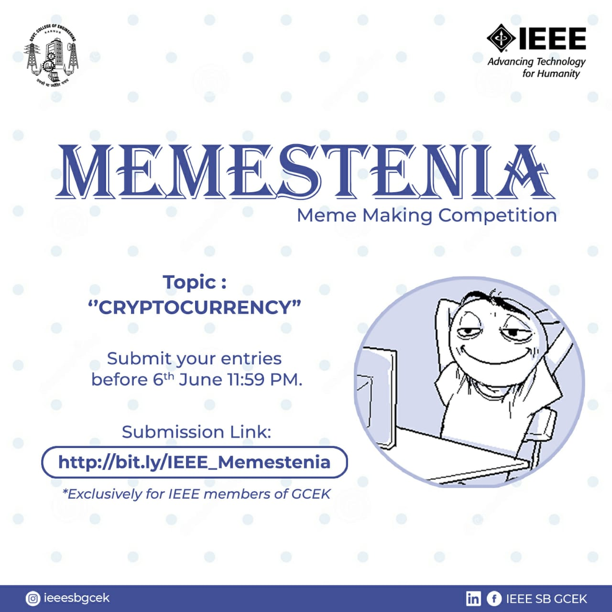

IEEE SB GCEK conducted ‘Memestenia’, a meme-making competition. The topic was ‘Cryptocurrency’. 13 members submitted their entries. All the entries were creative and funny. Vyshnav M K and Jinu Raju of 2k20 CSE bagged the first and second places respectively.
Our members commented that the event was creative and different.

        