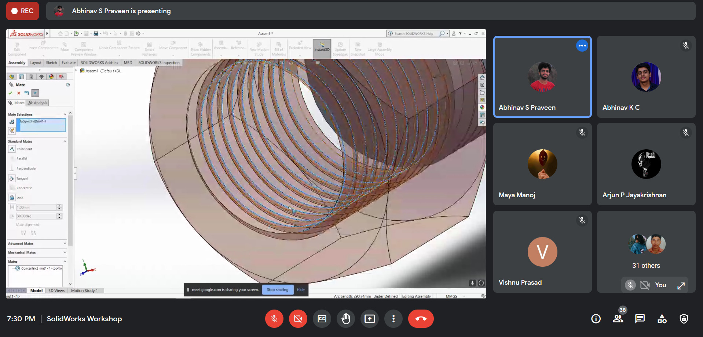

IEEE SB GCEK, in collaboration with SAE GCEK, conducted a workshop on Solidworks for all students of GCEK, at 6 PM on 6 June 2021. 
The speaker was Mr Abhinav S Praveen, a student of 2K17 ME batch. Over 43 students attended the session. It lasted for about two hours. The speaker covered the basics of CAD, Solidworks interface and demonstrated the design of some models.
The session was said to be useful for our members and received good feedback.

        