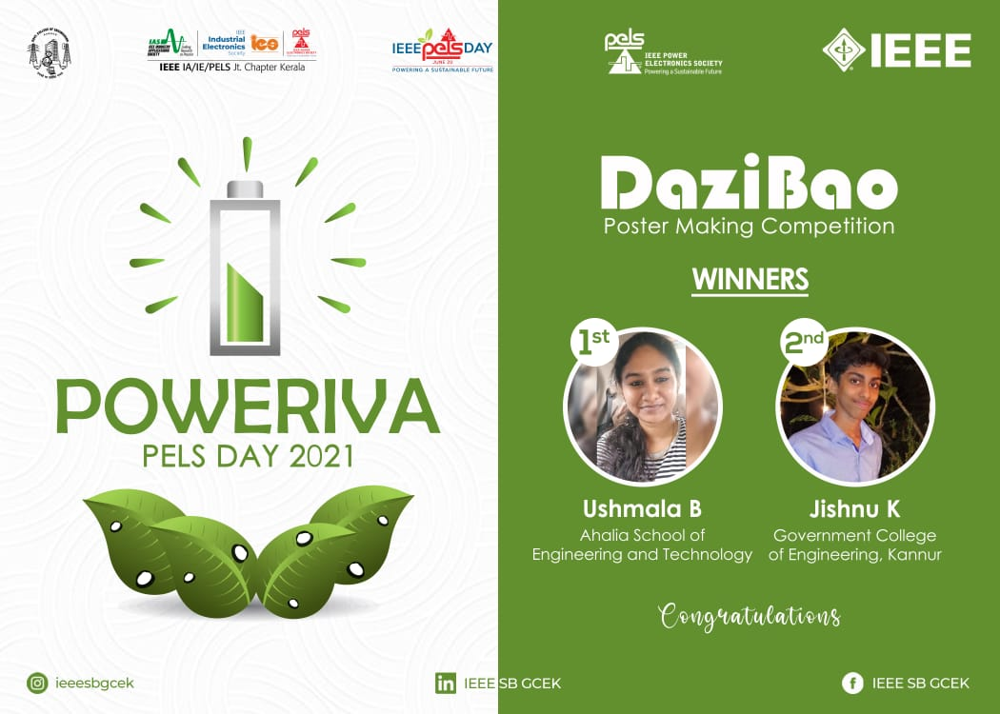

IEEE PELS SBC GCEK celebrated PELS Day under the title "POWERIVA".  The first event conducted under this was a poster-making competition "DaziBao". The competition was open to all IEEE members. The topic given for poster making was "Sustainability and Renewable Energy" to make students aware of the importance of sustainable development and the use of renewable energy. The posters of the students were collected through a google form before June 11th, 2021. 25 participants submitted their creative posters.  The first prize was bagged by Ushmala B of Ahalia School of Engineering and Technology  and the second prize was bagged by Jishnu K of Government College Of Engineering Kannur.

        