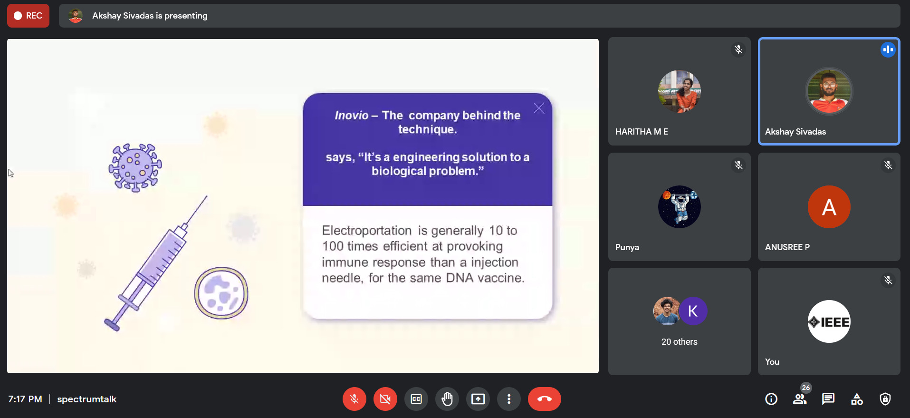

IEEE SB GCEK conducts talks exclusively for its members, based on 'IEEE Spectrum', a monthly magazine published by IEEE. This is to introduce our members to new technologies and inventions. The fifth Spectrum Talk was conducted on 11 June 2021 at 7 PM. 
Akshay Sivadas of 2k18 ECE delivered a talk on the topic ‘Vaccines Go Electric’. He spoke about the advancements and innovations in the research and development of vaccines. He also discussed how technology is helping humanity survive this pandemic.
The talk lasted for about 20 minutes. There were 29 members among the audience. They cleared their doubts on the topic.
The talk was interactive and received good feedback from the listeners.

        