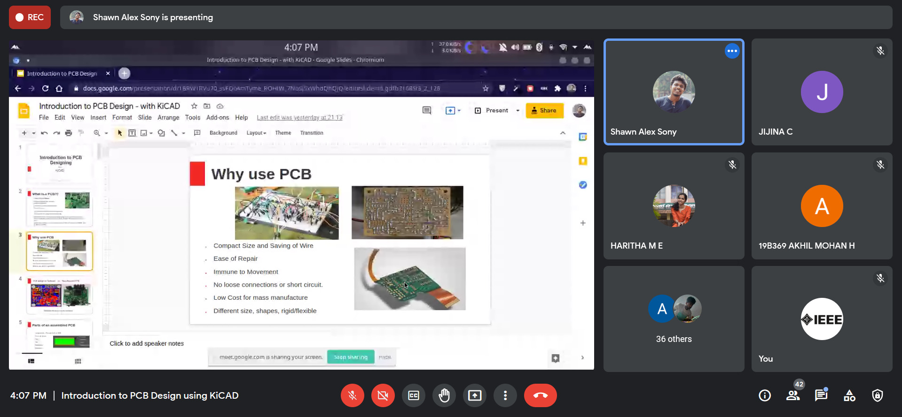

IEEE IAS SBC SB GCEK conducted a workshop on Introduction to PCB Design using KiCAD. The speaker was Mr Shawn Alex Sony, Hardware Design Engineer, Mistral Solutions Pvt Ltd. The session was hosted on Google Meet, on 13 June 2021 at 4 PM. About 40 participants attended the workshop. The Speaker gave a good start by talking in detail about printed circuit boards. He familiarized the listeners with the environment of KiCAD and how to use it. He did various electronic design automation and highlighted how to convert the design of schematics for electronic circuits to PCB Designs. 
The session lasted for two hours, and ended with a doubt clearing session of the participants by the speaker. The event received a good response from the attendees.

        