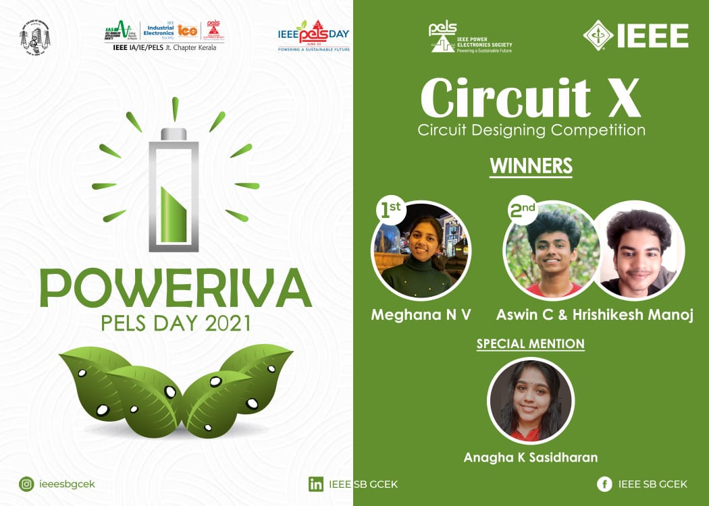

IEEE PELS SBC GCEK celebrated PELS Day under the title ‘POWERIVA’.  The second event conducted under this was ‘Circuit X’, a circuit designing competition. The event consisted of two rounds. The first round was conducted on 15 June and the second round was conducted on the following day, June 16. The students were allowed to register as individuals or as a group of two students. There were 22 individual registrations and 17 group registrations.  The first round focused on the identification and debugging of circuits. Of the total 17 groups and 7 individuals who participated in the first round, 6 groups and 4 individuals were selected for the second round. Those students who passed the first round, faced the second round which was circuit designing. In the second round, 4 groups and 4 individuals participated. The first prize was bagged by Meghana N V and the second prize was bagged by the group whose members are Aswin C and Hrishikesh Manoj. Anagha K Sasidharan was specially mentioned for her enthusiastic participation. Overall the event received positive feedback.

        