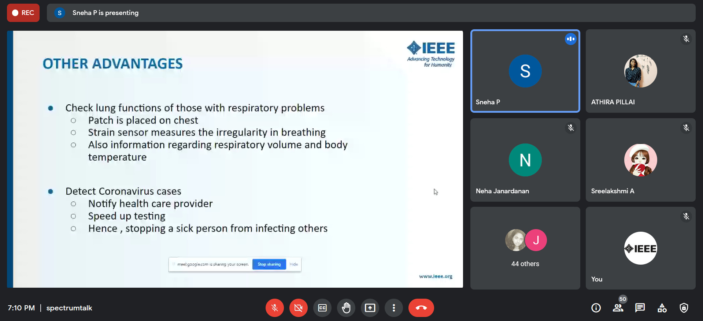

IEEE SB GCEK conducts talks exclusively for its members, based on 'IEEE Spectrum', a monthly magazine published by IEEE. This is to introduce our members to new technologies and inventions. The sixth Spectrum Talk was conducted on 18 June 2021 at 7 PM. 
Sneha P of 2k20 ECE delivered a talk on the topic ‘Wireless Smart Bandage’. She spoke about how wireless smart bandages can be a breakthrough in the medical field. She discussed the current stage of development of this technology, its limitations and scope for future advancements.
The talk lasted for about 20 minutes. There were 51 members among the audience. They cleared their doubts on the topic.
The talk was interactive and received good feedback from the listeners.

        