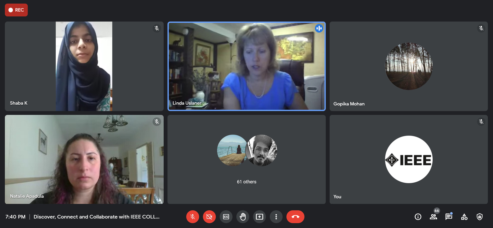

IEEE SB GCEK conducted a webinar on the topic ‘Discover, Connect and Collaborate with IEEE Collabratec’, with an aim to make our members aware of the significance and opportunities of IEEE Collabratec. The speakers were Ms Linda Uslaner (Programme Director, IEEE Collabratec) and Ms Natalie Apadula (Marketing Specialist, IEEE Collabratec).  The programme began at 7 PM on 19 June 2021. Ms Shilpa Suresh welcomed the speakers and participants. Ms Shaba K moderated the session. The speakers covered all aspects of Collabratec - its interface, benefits, the importance of using it, the opportunities it presents etc. About 81 members joined us to listen and interacted with the speakers by asking questions.
The event received a great response from our members and the audience left eager to create their Collabratec profiles.

        