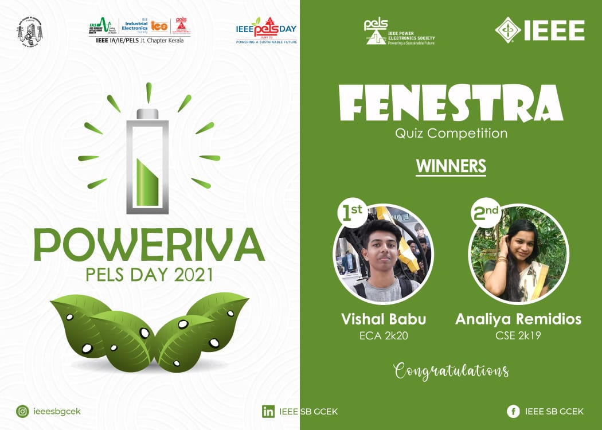

IEEE PELS SBC GCEK celebrated PELS Day under the title "POWERIVA". The third event conducted under this was a quiz competition "FENESTRA''. The questions of the quiz were based on Power Electronics Society to help students to get more information about this society. The competition was conducted through google forms on 20th June 2021 at 7 PM. There were a total of 60 registrations and of them, 48 of them participated in the competition. The event was conducted for IEEE members of the Government College Of Engineering Kannur. Vishal Babu bagged the first prize and the second prize was bagged by Analiya Remidios.  The event received good feedback from the participants in terms of its relevance and organization.

        