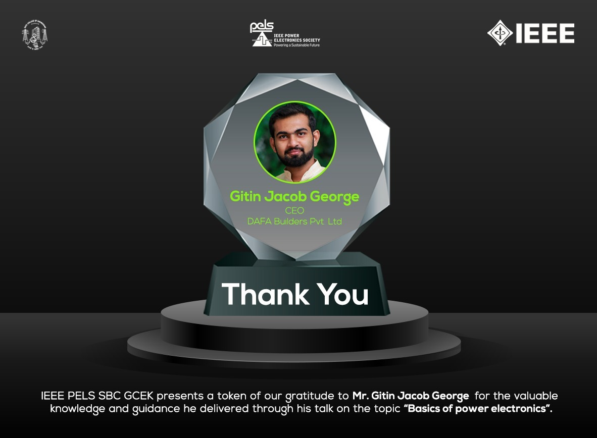

IEEE PELS SBC GCEK in collaboration with IEEE Kerala Young Professionals, hosted a webinar on the topic "Basics Of Power Electronics". The speaker Gitin Jacob George, CEO - DAFA Builders Pvt. Ltd gave the student members a very clear idea about power electronics. Topics he spoke of include the need for power electronics, power systems, switches, and their types.  

About 35 members from our SB joined the webinar. The event was welcomed by the attendees and received very good feedback.

        