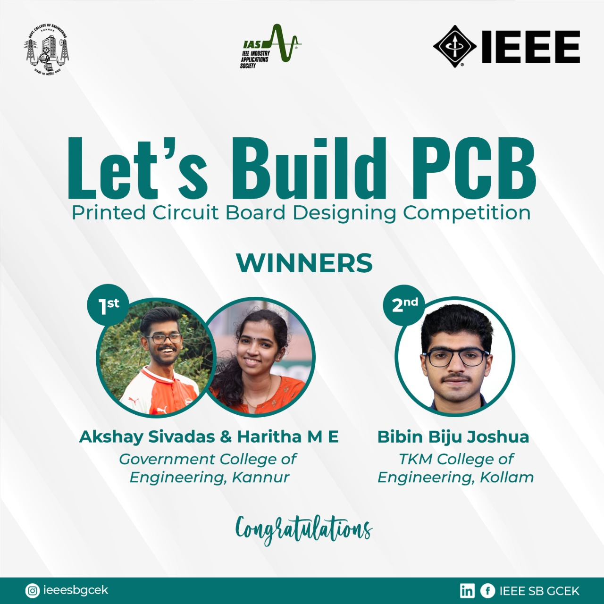

IAS Chapter of IEEE SB GCEK conducted a PCB Designing competition- ‘LETS BUILD PCB’ following the Workshop on ‘Introduction to PCB Designing’ held a week ago. The PCB Designing competition was held on 26th June 2021 at 6 pm. The event was open to all students, both IEEE and non-IEEE members. About 90 participants registered for the competition. The PCB design question for the competition was provided via WhatsApp Group of the participants and three hours’ time was provided. Participants were allowed to make use of any PCB Designing Software like KiCAD, Eagle etc for circuit designing. Participants were directed to submit their entries within the stipulated time to the event coordinators. Entries of the Participants were evaluated by Shawn Alex Sony, Hardware Design Engineer, Mistral Solutions Pvt Ltd., who was the speaker of our previous PCB Designing Workshop. 
Haritha ME and Akshay Sivadas  of Government College of Engineering, Kannur bagged the first prize and the second prize was bagged by Bibin Biju Joshua, TKM College of Engineering, Kollam. The competition received good response from all participants as it enabled them to apply their understanding from the workshop to design a circuit through this competition.

        