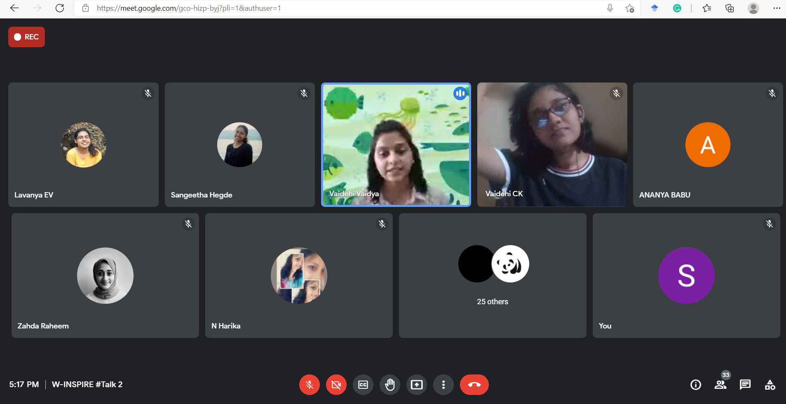

W-Inspire hear from inspiring women was a talk series highlighting inspiring women from various industries. Based on their expertise they shared very useful information with the students which helped them in boosting their careers. The event was held in collaboration with ISTE GCEK SC  and commencing three talks in whole. The second session was delivered by Ms.Vaidehi Vaidya, Founder, and MD, Women in Sports India on the topic ‘Session on Sports Management.’

        