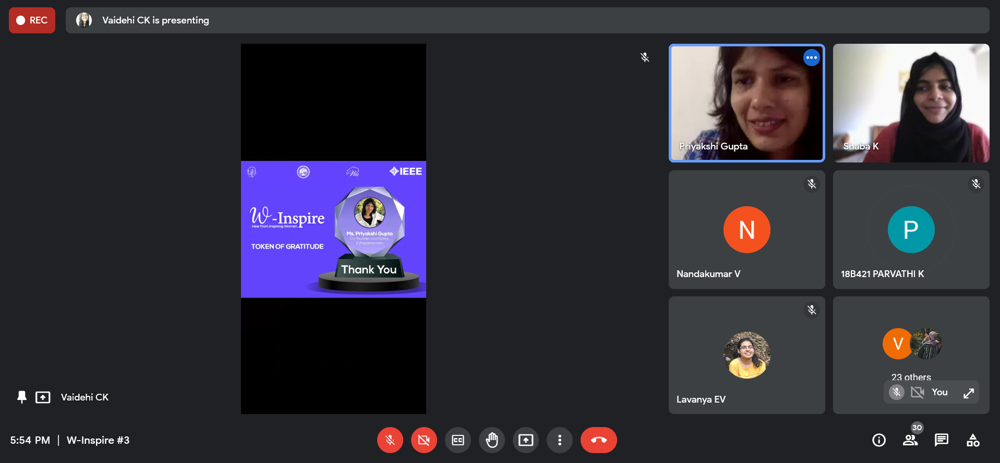

W-Inspire hear from inspiring women was a talk series highlighting inspiring women from various industries. Based on their expertise they shared very useful information with the students which helped them in boosting their careers. The event was held in collaboration with ISTE GCEK SC  and commencing three talks in whole. The third session was delivered by Ms. Priyakshi Gupta, Co-founder, and editor at EVreporter.com on the topic ‘Technical writing and entrepreneurship.’ 

        