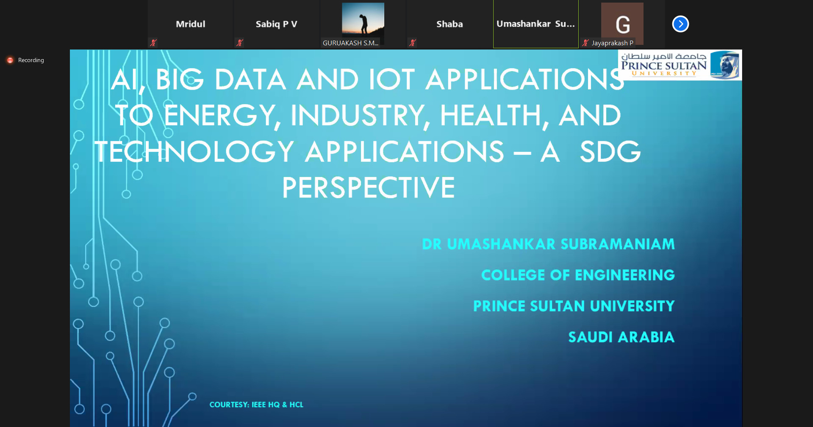

IEEE SB GCEK, in collaboration with the IEEE Malabar Hub and IEEE Malabar Subsection, conducted a webinar on 8 July 2021, as part of the 58th webinar of the Malabar Hub’s Webinar Series. The speaker was Dr. Umashankar Subramaniam (Professor and Distinguished Researcher, Prince Sultan University, Riyadh, Saudi Arabia). The talk was titled ‘AI, IOT and Big Data Applications to Energy, Industry, Health and Technology - A SDG Perspective’. 
The webinar started at 5:30 PM. The speaker gave a deep outlook on various aspects of technology, the new trends, and future applications and challenges. About 63 members attended the webinar. It ended by 6:30 PM after a Q&A discussion. It was an informative and insightful talk. 

        