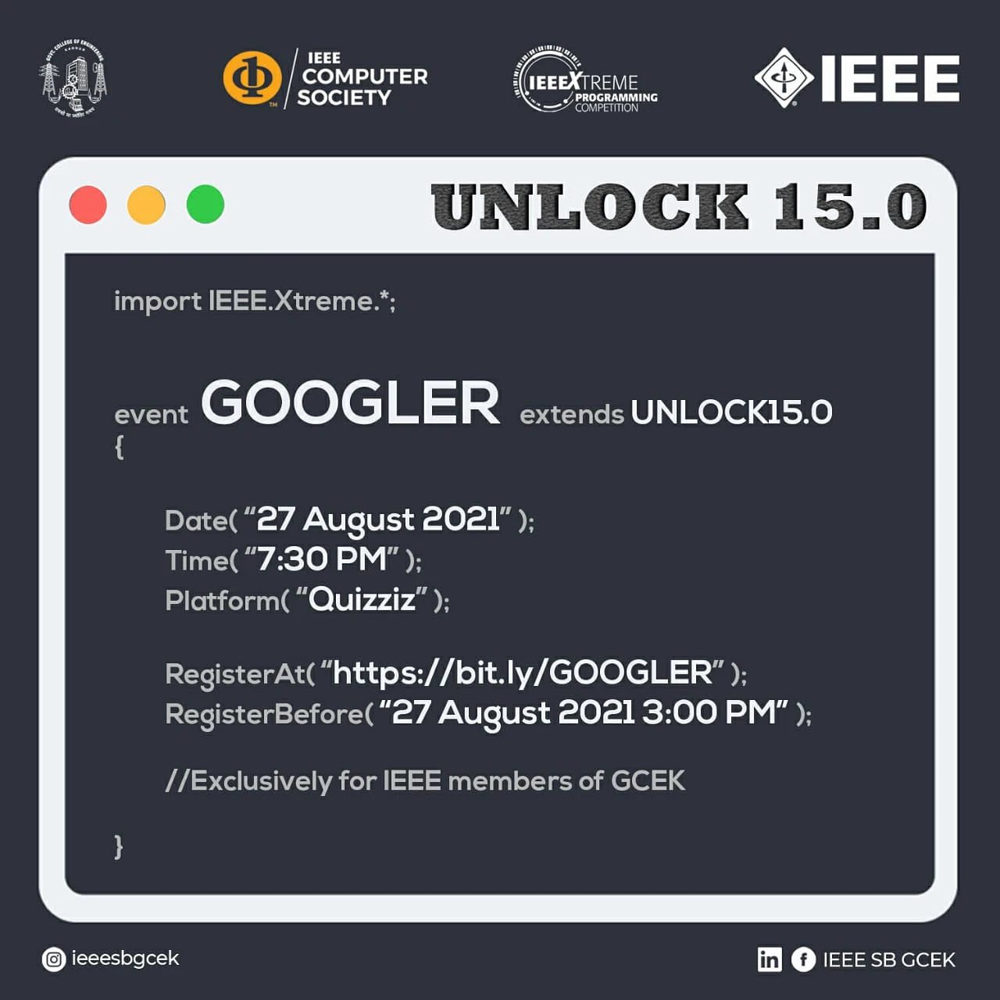

IEEE CS SBC GCEK conducted ‘Googler’ under the banner of UNLOCK 15.0 on 
27 August 2021 exclusively for the IEEE members of GCEK. The contest began at 7:30 PM on Quizziz platform. The contest got massive responses with 76 registrations of which 63 submissions were made. Analiya Remidios of S4 CSE grabbed first place. Samanyu B G of S2 CSE secured second place and Vaishnav S Nambair of S2 EC B reached third in the contest.

        