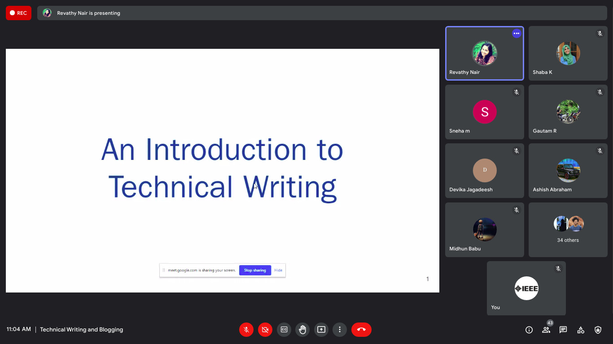

IEEE SB GCEK conducted a talk session on 28 August ‘21, on ‘Technical Writing and Blogging’. The speaker was Ms. Revathy Nair, an experienced Technical Writer and Business Analyst at UST Global.
The session began at 11 AM. The speaker began by introducing the audience to technical writing and blogging as a career opportunity. She discussed the various aspects of technical writing, areas to explore, techniques to practice and tips to upskill oneself. She also guided the listeners on how to find opportunities in this field.
The session ended with a Q&A segment where the audience cleared their doubts. The talk was very informative and was commented to be useful by the listeners.

        