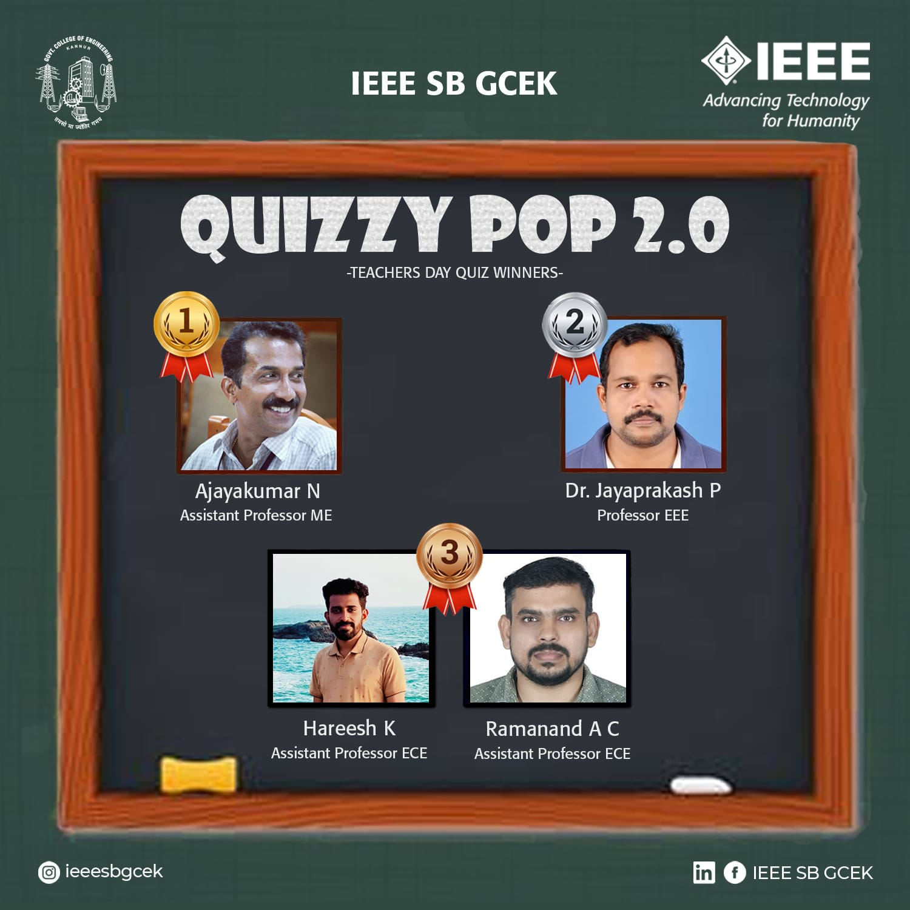

On the occasion of Teacher’s Day, IEEE SB GCEK conducted the second edition of our Teacher’s Day Quiz Competition for the teachers of GCEK. The quiz was held on 5 September 2021 at 7 pm, through Google Forms. 37 teachers of our college participated.
Mr. Ajayakumar N of the Mechanical department secured first place. Dr. Jayaprakash P of EEE department secured the second place. Mr. Hareesh K and Mr. Ramanand A C shared the third place.
The event received good feedback from the faculties.

        