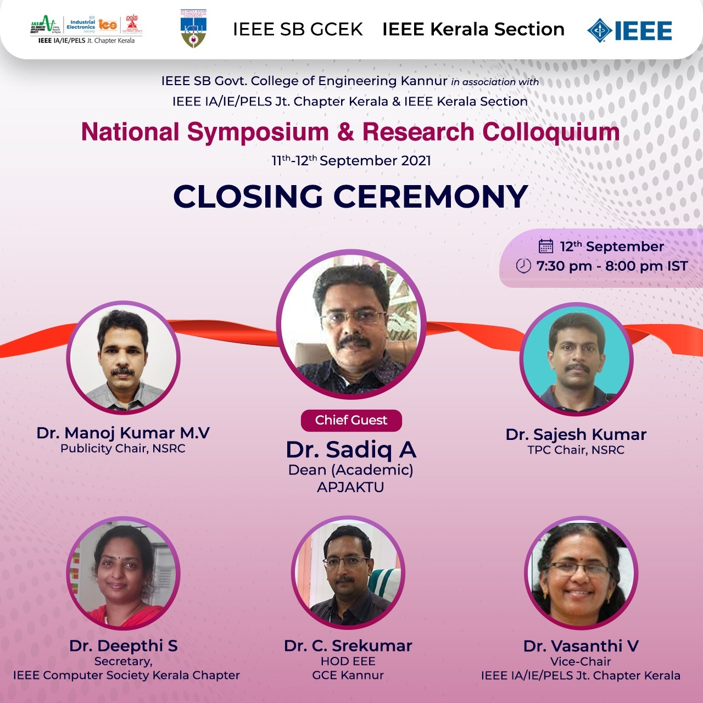

The National Symposium and Research Colloquium was held from 11th - 12th of September 2021. It was organized by IEEE SB Government College of Engineering, Kannur in collaboration with IEEE IA/IE/PELS Jt. Chapter Kerala, IEEE LINK and IEEE Kerala Section. Consisting of five tracks in total, it was focused on promoting the research work of Master’s students and Ph.D. scholars. The tracks were Ph.D EEE, Ph.D ECE & CSE, M.Tech EEE, M.Tech ECE & ICE, and M.Tech CS & IT. The emphasized area was anything related to recent trends in Electrical, Electronics, and Computer Science Engineering.

The registrations were opened on July 22, 2021 until Aug 11, 2021. Out of 67 participants registered for the event, after various shortlisting processes 34 of them presented in the final presentation. Prior to every presentation track beginning, keynote sessions were given on recent technologies by eminent people working in various research fields. 

The event commenced with the PhD EEE track on 11 of September at 10:00 AM followed by PhD ECE & CSE track. The Keynote session for the first track was by Prof. Pajof Prabhakaran, Assistant Professor, NIT Surathkal on ‘Research scope and challenges in EV’. The keynote session for Ph.D ECE & CSE Track was given by Dr. Deepthi P P, NIT Calicut, on ‘Privacy-preserving Machine Learning’. The inaugural ceremony was held on the same day at 6:00 PM. The chief guest for the event was Dr. Shalij PR (Research Dean, KTU). 

The second day commenced with the M.Tech EEE track, followed by M.Tech ECE & ICE and M.Tech CSE & IT tracks. The keynote session for the first track was given by Dr. Jishnu KK, IIT Roorkee, on ‘An approach towards mitigation of torsional interaction effects in electro-mechanical systems.’ The second keynote session was given by Dr. Shajee Mohan B S, GEC Kozhikode on ‘Machine Learning Techniques for Image Analysis.’ The third keynote session was given by Dr. Lijiya, NIT Calicut, on ‘It’s getting hard to detect deep fakes - A General Awareness.’ The closing ceremony was held at 7:30 PM on the same day. The chief guest for the ceremony was Dr. Sadiq A, Dean, Academic, APJAKTU, Kerala. 

The event overall provided a great insight towards research in various areas and gave an opportunity for students to showcase their works.

        