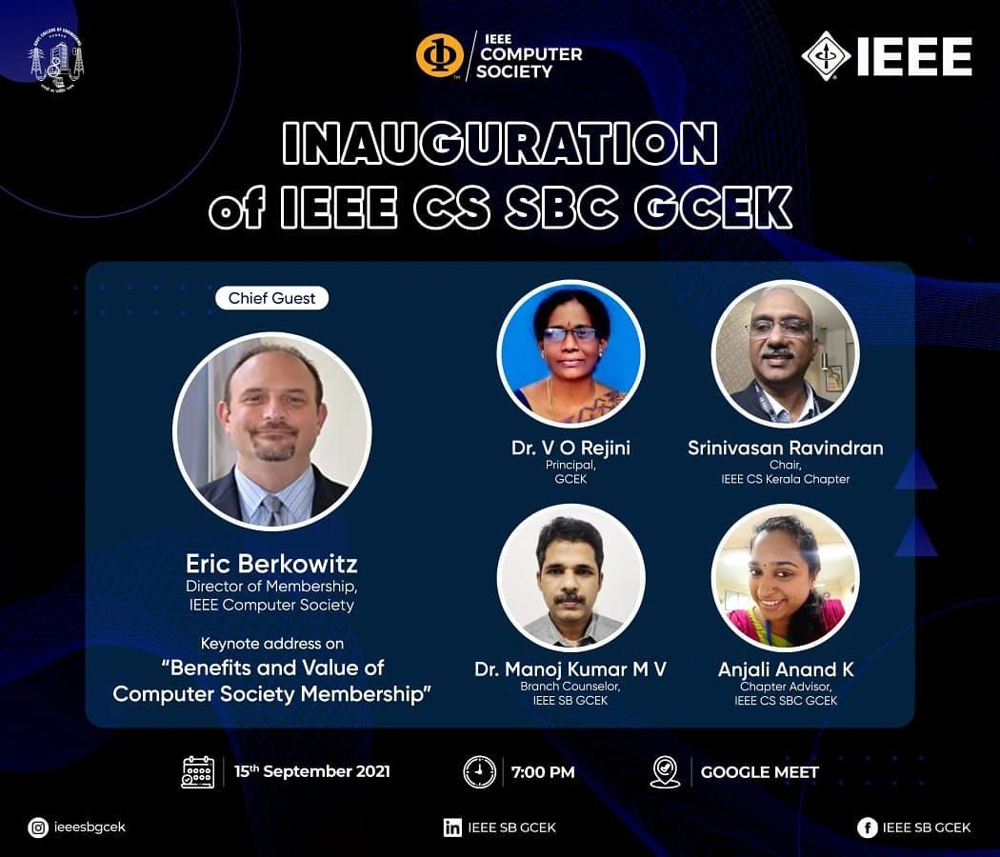

IEEE Computer Society SBC GCEK marked its commencement on 15 September 2021 with the inaugural ceremony. The meeting was conducted on the Google Meet platform. The ceremony began with the welcome address by Ms Haritha M E, Chairperson, IEEE SB GCEK, which was followed by the IEEE code of ethics by Mr Mridul P M, Secretary, IEEE SB GCEK. 
The Chief Guest of the ceremony, Dr V O Renjini, Principal, GCEK, delivered the inaugural speech and announced the Execom of IEEE CS SBC GCEK for the year 2021. We were lucky to have Mr Eric Berkowitz, Director of Membership, as the Guest of Honour, who delivered the keynote address on the benefits and value of Computer Society Membership. He also explained the importance of being part of such a community and how it assists a student to explore and learn about the modern trends in technology. 
Mr Srinivasan Ravindran, Chair, IEEE Computer Society Kerala Chapter,  graced the ceremony and conveyed his wishes for the future endeavours of our newly formed Computer Society. Our Branch Counsellor, Dr Manoj Kumar M V and our Chapter Advisor, Ms Anjali Anand K, also delivered the felicitation address. We expressed our gratitude to all the esteemed dignitaries by presenting virtual mementoes. More than 45 students attended the ceremony which concluded with the vote of thanks by Ms Pournami K K, Chairperson, IEEE CS SBC GCEK.

        