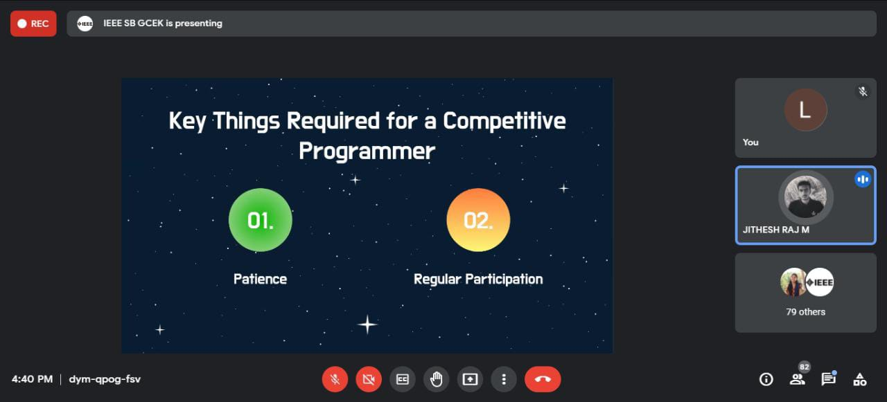

IEEE SB GCEK conducted a talk session titled Xtreme Talks, with an aim to introduce our members to the IEEEXtreme competition and to make them aware of its significance. The speakers were Jithesh Raj M, Campus Ambassador of IEEEXtreme 15.0, and Anugrah V, who achieved Global Rank 773 in IEEEXtreme 14.0.
About 65 members attended the session. It lasted for about an hour and a half.
The speakers and audience interacted well. The session was interesting and informative. The audience left inspired to prepare and participate in the event.

        