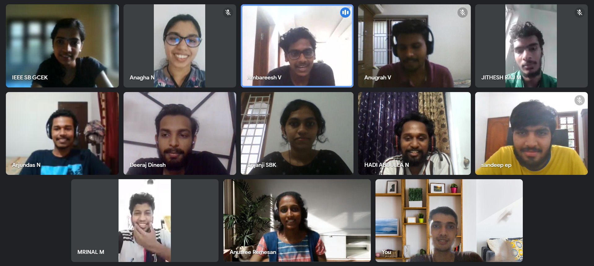

On 19 September 2021, IEEE SB GCEK conducted a farewell ceremony for our members who graduated in 2021. The ceremony was titled “Lamhe - the moments”. The programme started at 3 pm on Google Meet. 
Dr. V O Rejini, Principal of GCEK inaugurated and blessed the students a bright future. Dr. Manoj Kumar K V, our Branch Counsellor and Ms. Anjali Anand K, Chapter Advisor of IEEE CS SBC GCEK and WIE GCEK, presented felicitation. They appreciated the students’ contributions towards IEEE and the SB. They wished them a bright career.
Including 19 passing out students, 47 members participated. The students shared their memories and experiences of volunteering for IEEE. The programme concluded by 5:30 pm.

        