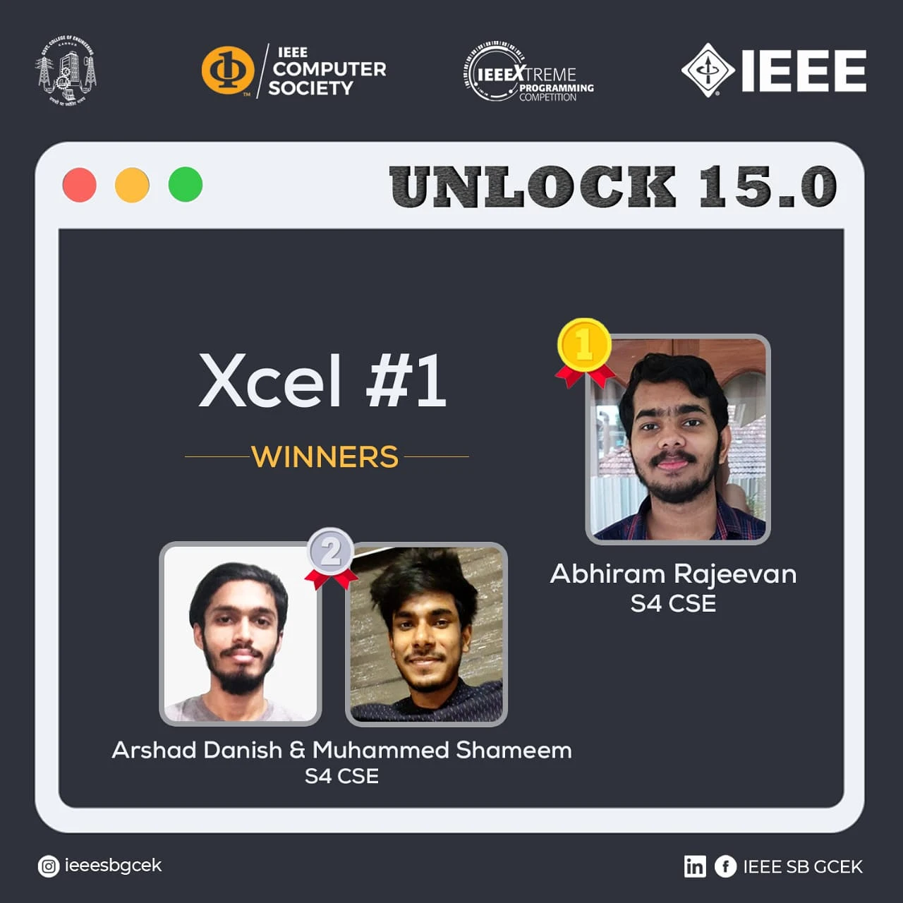

IEEE CS SBC GCEK conducted the first event of the MockXtreme contests, XCEL #1, under the banner of UNLOCK 15.0. The event was conducted on the hackerrank platform exclusively for the IEEE members of GCEK. The participants were to register with the same team as of IEEEXtreme. Out of 69 registrations, Abhiram Rajeevan of S4 CSE bagged first place. Arshad Danish and Muhammed Shameem secured second place. The event got great responses and helped all the participants to prepare for IEEE Xtreme.

        