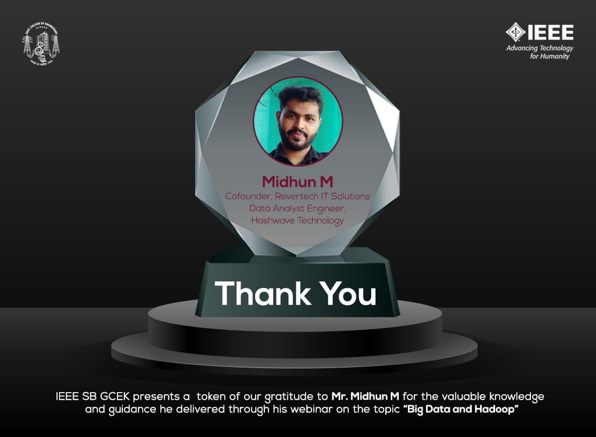

IEEE SB GCEK conducted a webinar on ‘Big Data and Hadoop’, on 25 September 2021. The session began at 7 pm and was conducted on Google Meet.
The speaker was Mr. Midhun M, Cofounder of Revertech IT Solutions, and Data Analyst Engineer at Hashware Technologies.
The session focussed on a basic introduction of Big Data and how Hadoop is used in the industry. The speaker also discussed the extensive range of opportunities it has to offer. The session was a great learning experience and 33 students attended the session. It ended by 08:30 pm with a QnA session.

        