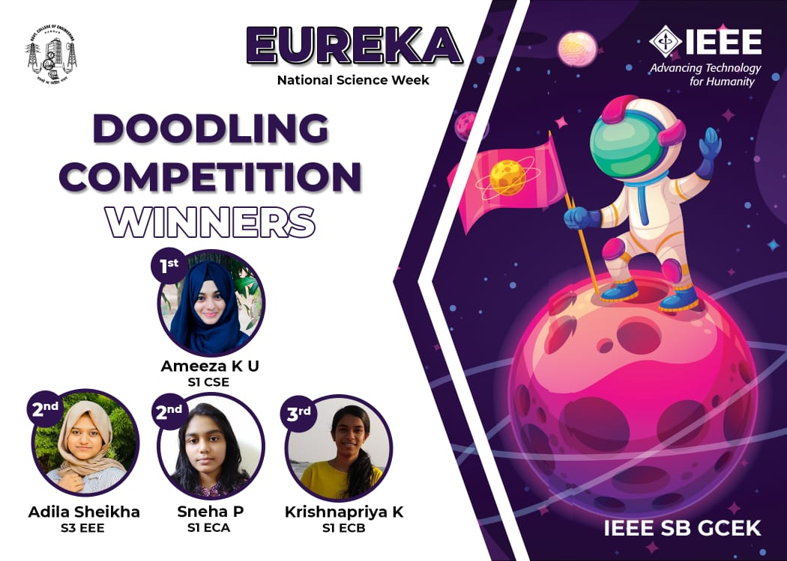

No. of Participants: 26
Coordinators: Avani, Mehnaz

IEEE SB GCEK celebrated the National Science Week under the title ‘Eureka’.
With an aim to trigger the members’ creativity and imagination, the first competition was  a Doodling Competition on the topic ‘Space Exploration’. The competition was announced on 21st February and the submissions of participants were collected through a Google Form until 24th February 2021. 
26 participants submitted their entries. The first prize was bagged by Ameeza K U of S1 CSE. The second prize was shared among Adila Sheikha of S3 EEE and Sneha P of S1 ECA. Krishnapriya K of S1 EC B secured the third place.

