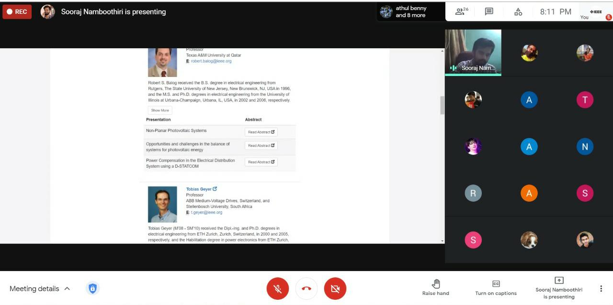

PELS chapter of IEEE SB GCEK in collaboration with the IAS chapter came up with a session, "KNOW YOUR SOCIETY".  The session mainly focused on making the student members aware of the wide range of benefits that are available by becoming a member of these societies.  There were 40 registrations for the session. The session was handled by Sooraj V Namboothiri (Student Representative IEEE IA/IE/PELS Jt. Chapter Kerala) and Govindaraman S (Kochi Hub Student Representative IEEE IA/IE/PELS Jt. Chapter Kerala). It was conducted on the Google Meet platform on 22nd May 2021 at 7 PM.  The session was very interesting. The speakers covered almost all the important benefits of becoming a member of these societies. The students  actively interacted with the speakers and they gave positive feedback for the session.

