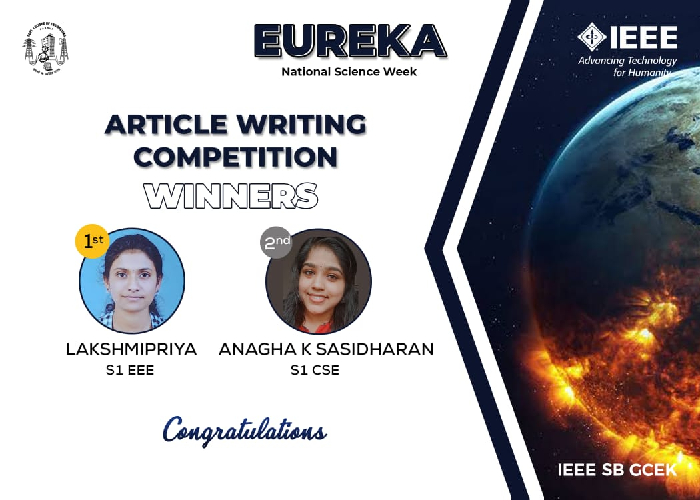

No. of Participants: 31
Coordinators: Jishnu, Jithesh

IEEE SB GCEK celebrated the National Science Week under the title ‘Eureka’.
With an aim to trigger the members’ creative writing and to increase awareness of climate change and other threats of global warming, the second competition was  Article Writing on the topic ‘How Technology can help reduce Global Warming and Climate Change?’.
The competition was announced on 23rd February and the submissions of participants were collected through a Google Form until 26th February 2021.

31 participants submitted their entries. The first prize was bagged by Lakshmi Priya of S1 EEE and the second prize by Anagha K Sashidharan of S1 CSE.

