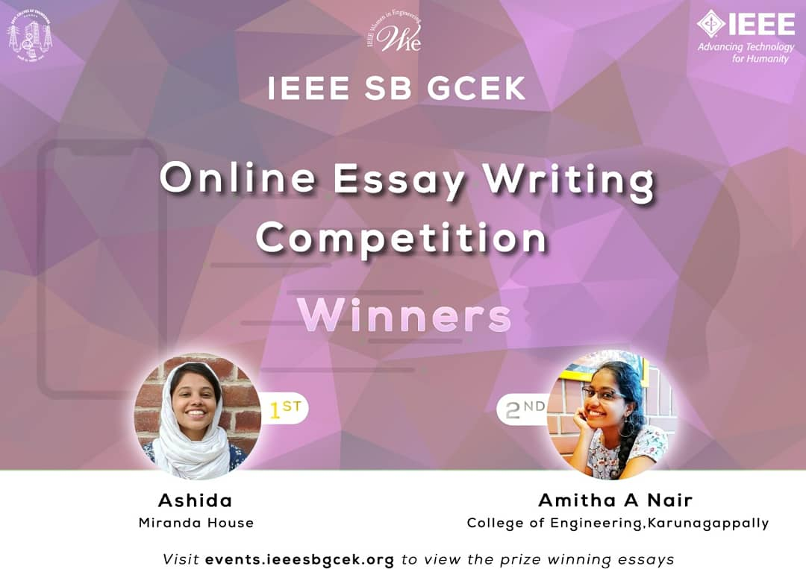

An Online essay writing competition was conducted on 23rd March, under WIE affinity group of IEEE SB GCEK on the topic “WHAT IS HUMANITY?,WHAT DEFINES HUMANITY?”. The competition was open to both IEEE and non-IEEE members, including the students of other colleges. Registered candidates were informed to log on to the student branch website at 10am on 23rd March and the topic was revealed there. Ashida (Miranda House) and Amita A Nair (College of Engineering, Karunagapally) bagged 1st and 2nd positions respectively.

