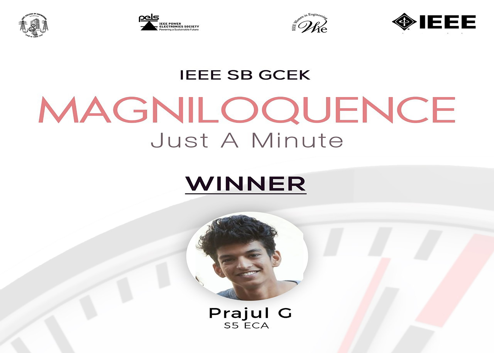

As part of energy conservation day, a jam was conducted by the PELS and WIE societies of IEEE SB GCEK on 23rd December 2020. Participants were asked to upload a 1-minute video of themselves speaking on the topic CITIES: URBANISATION AND RISING ENERGY DEMAND before 23rdDecember. The winner of this event was Prajul G of S5 EC. The coordinators of this event were Namitha and Anusree.

