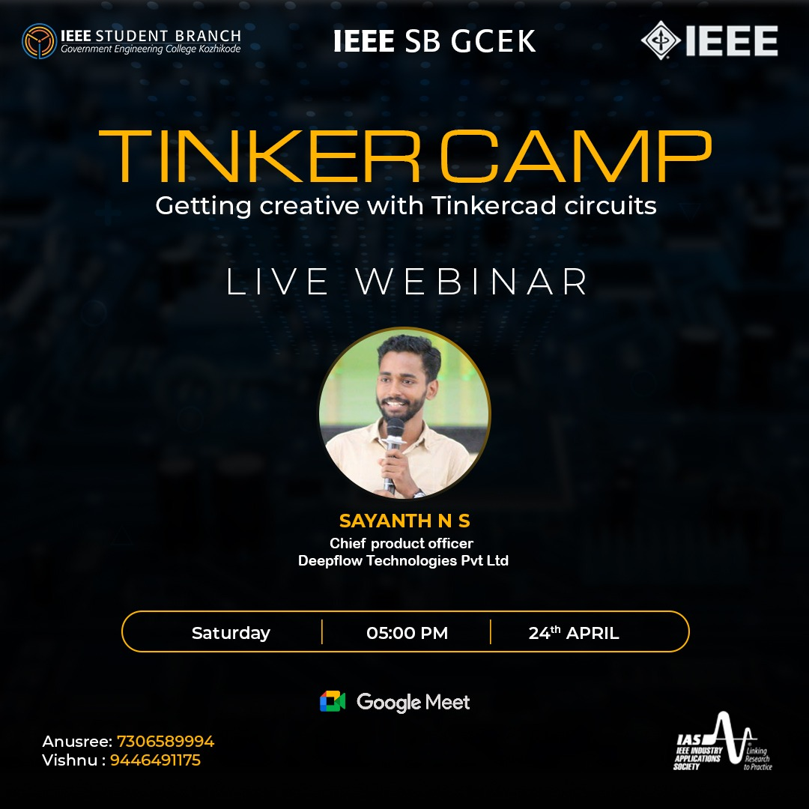

IAS chapter of IEEE SB GCEK in collaboration with IAS chapter of IEEE SB GECK, conducted a three-days event named ‘TINKER CAMP’, focusing on Tinkercad platform. Familiarizing the Tinkercad software and organizing events related to the same were the goal of the event.
A webinar was the first programme among the series of events conducted as a part of this. It was organized for introducing the Tinkercad platform, its utilities and its application to students for designing and simulating electric circuits and arduino projects. 
The webinar was titled as ‘Getting creative with Tinkercad circuits’. The session was handled by Mr. Sayandh N S (Chief Product Officer, Deepflow Technologies Pvt.Ltd). The session was held via Google Meet which began at 5 pm and lasted for about an hour.
It was an interesting session where all the points were covered from the basic level. There was a registration count of 143 members from which 73 registrants attended the session. The event was an overall success. The participants who joined the session left the session with a good exposure to tinkercad platform. The feedback received from the attendees was very positive.

