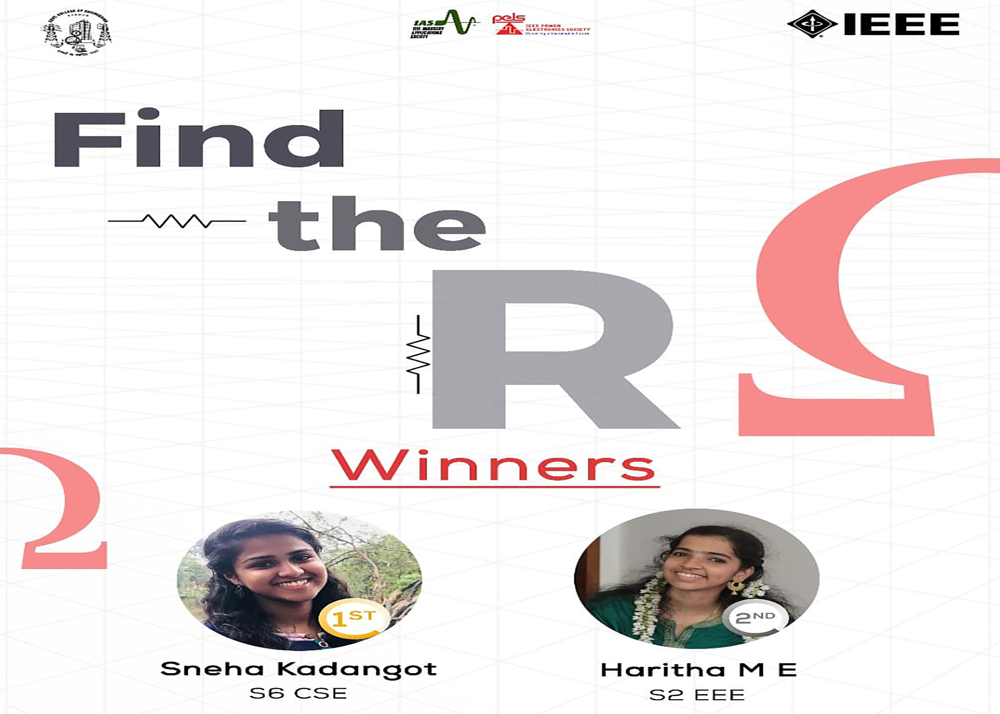

Find the R was a quiz competition in which the domain was questions related to Resistors. The IAS and PELS Chapter of IEEE SB GCEK collaborated together and conducted the same. The event was exclusively for IEEE members of GCEK. Out of 24 participants, Sneha Kadangot (S6 CSE, GCEK) bagged the first prize and Haritha M E (S2 EEE, GCEK) bagged the second. Was indeed a great event!

