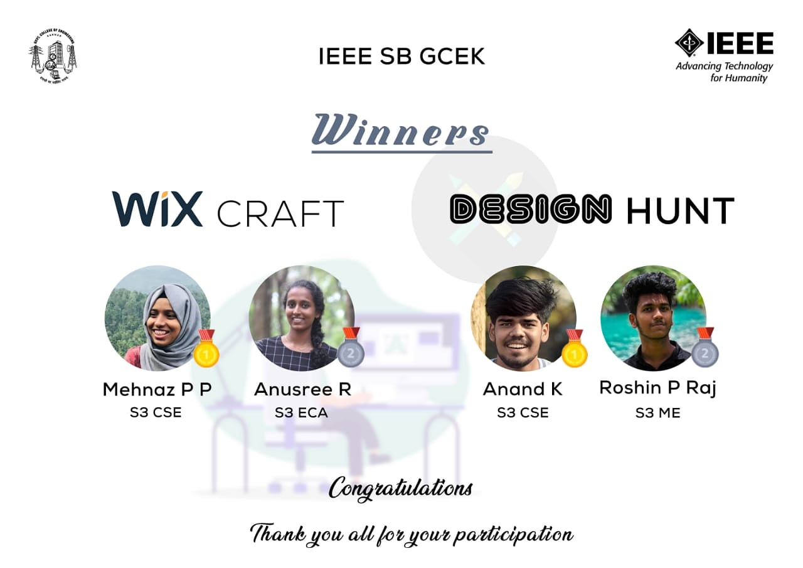

Coordinators : Abhishek k and Jishnu PM
IEEE SB GCEK conducted a front end web designing competition ‘WIX Craft’ as a part of SB’s theme based event series. Participants are instructed to design a web site on ‘WIX’ on the theme ‘LOLLAPALOOZA’ which was an online event conducted by IEEE SB GCEK. The event was conducted on 21 and the link for submission was given to them on 22/11/20 and they were asked to submit their work by 11:15 am. Mehnaz P P and Anusree Rameshan bagged 1st and 2nd positions respectively. There was active participation from the members.

