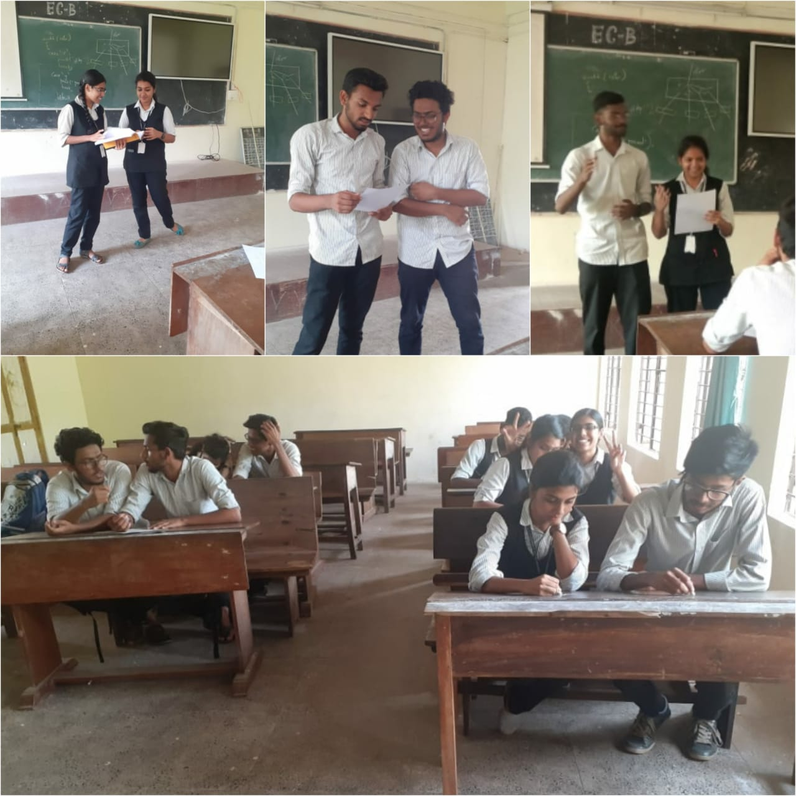

Power Electronics Society of IEEE SB GCEK conducted a problem solving competition named “Unscript the hack” on 25th February 2020.
It was a team wise event with each team comprising of 2 members. 5 groups participated in the event. The problem given was “E-Waste Management”. The participants had to find solutions and present it.
The event continued started at 4pm till 4:45pm. Shilpa Suresh and Lavanya EV of S4 CSE bagged the first prize and Ambareesh V Sankaran of S4 CSE and Haritha of S2 EEE got the second prize.

