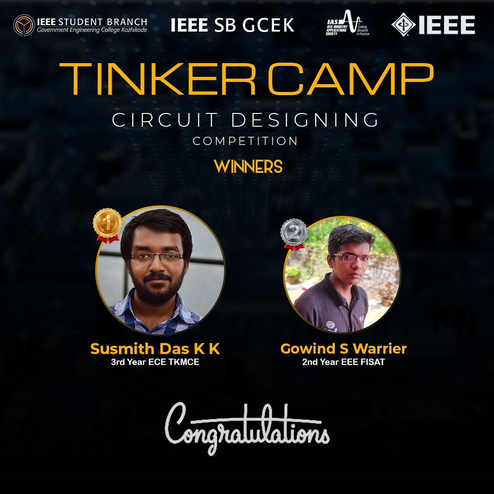

IAS Chapter of IEEE SB GCEK in collaboration with IAS chapter of IEEE SB GECK conducted a three-days long event focusing on Tinkercad platform. Familiarizing the Tinkercad platform and organizing events related to the same were the goal of the event. The event was named as ‘TINKERCAMP’ as it was solely based on the Tinkercad platform. 
A circuit designing competition using Tinkercad was the second programme of Tinker Camp.
The event consisted of two rounds. The first round was to design a circuit to illustrate the working of a npn transistor as switch using led as an indicator. 21 participants joined for the first round out of which 11 participants were qualified for the next round.
The second round was to design a circuit that functions as an obstacle detector that calculates distance from an object in centimeters and if the object is within 70cm, the led should turn red otherwise green.
Susmith Das K K , 3rd year ECE, TKM college bagged first prize and Govind S Warrier, 2nd year EEE, FISAT bagged the second position. Cash prizes were awarded to the winners. The event received satisfactory responses from all the participants. 

