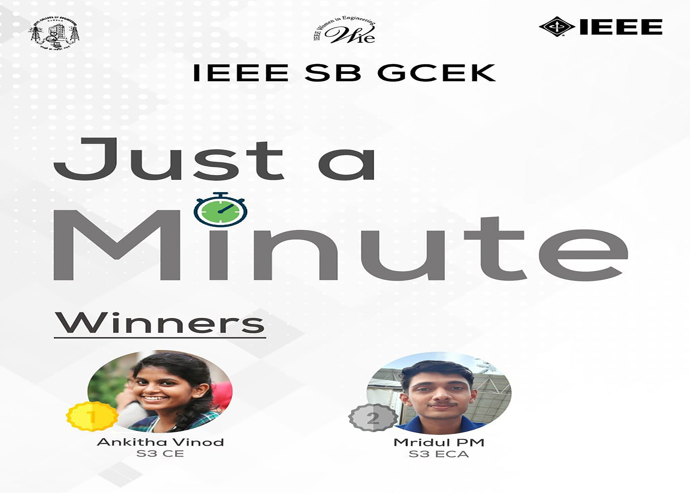

WIE Affinity Group of IEEE SB GCEK conducted a Just a Minute( JAM) competition. The competition was held in the Google Meet platform. There were total 7 participants from different branches. All were allowed to speak exactly for 1 minute on a randomly given topic selected with the help of an online spinner. The online timer was also shared which helped participants to keep track of time. The competition began from 3pm and lasted for around 40 minutes. Dileep sir and Bincy miss were the judges. After the competition was over, both the judges gave their opinions for the same. All the participants enjoyed the online JAM competition.
On the next day, winners of JAM were announced. First prize was bagged by Ankitha Vinod of S3 CE and second prize was bagged by Mridul PM of S3 EC A.
COORDINATORS: Aswin, Lavanya, Yadhukrishna
NO. OF PARTICIPANTS: 16

