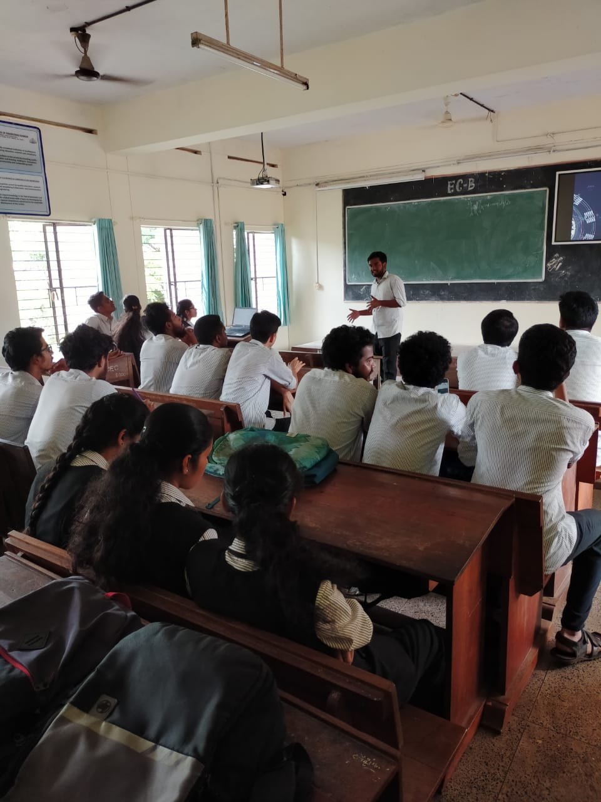

Our fourth spectrum talk was held on a very interesting topic “ROUTERS IN SPACE". This talk was conducted on Thursday,27th Feb at 12.30pm in S2 ECB by  Alif Muhammed S of S6 EEE. He explained about how The Space Router provided the ability to route internet protocol computer network traffic on board the satellite, which enabled users of Web, VoIP and other IP applications to directly communicate without having to double-hop data to and from an intermediate Earth station. The talk was really interesting and it created curiosity among the viewers. There were many doubts as well which was very well clarified by him.

