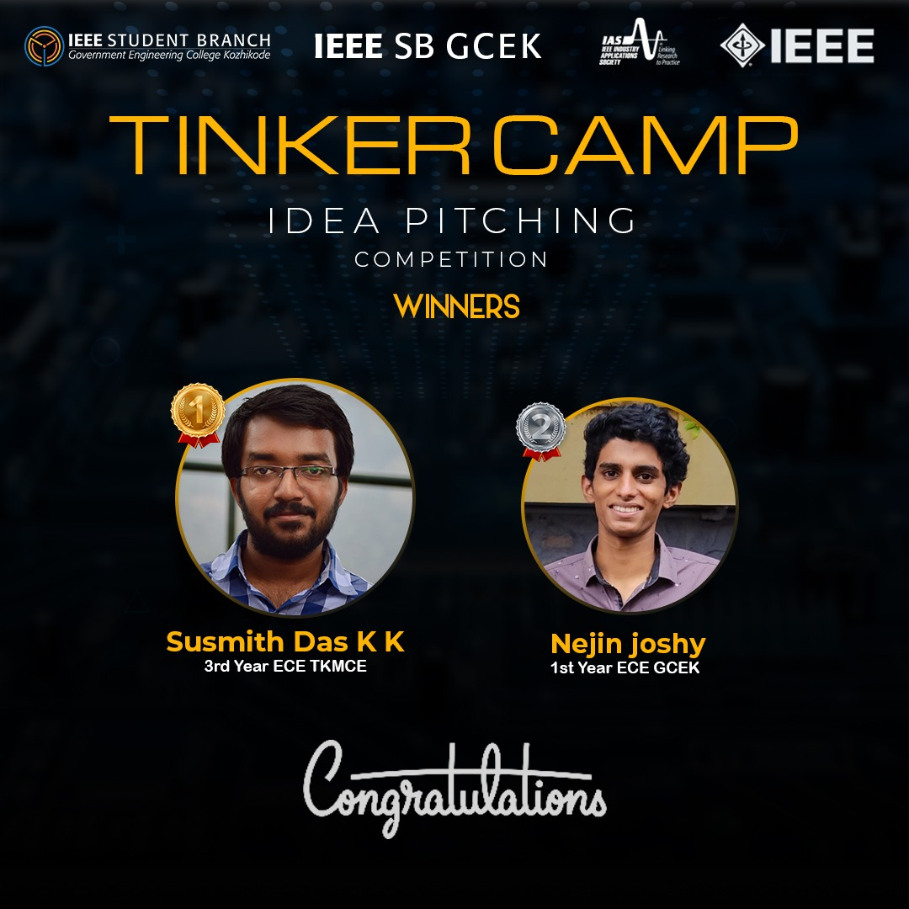

IAS Chapter of IEEE SB GCEK in collaboration with IAS chapter of IEEE SB GECK conducted a three day event focusing on Tinkercad platform. Familiarizing the Tinkercad platform and organizing events related to the same were the goal of the event. The event was named as ‘TINKER CAMP’ as it relied solely on the Tinkercad platform. Idea pitching was one among the series of events conducted as a part of this.
It was the third event of Tinker Camp. Two problems statements based on traffic and road congestion were given to the participants. The participants could choose either of the two and they were also given one day time to come up with the solution for cracking the problem they selected. Individual and group participation in a group of two members were allowed. The solution was asked to submit in the form of abstract via google form. The event consisted of two rounds. The first round was an abstract submission, among which the best 5 abstracts were selected to the second round.
In the second round, selected participants were directed to present their ideas through Google Meet from which the winners were selected. The judging panel of the presentation consisted of three professors from GCEK and GECK.
Susmith Das K K, third year ECE from TKM College of Engineering bagged the first prize. He came up with an idea of an automated platform that carries people and the system which dynamically controlled the number of people crossing the road. The second prize was bagged by Nejin Joshy, first year ECE, GCE Kannur. His idea was a laser-assisted pedestrian crossing in urban areas. Cash prizes were awarded to the winners. The event received good responses from the participants as well as from the judges. 

