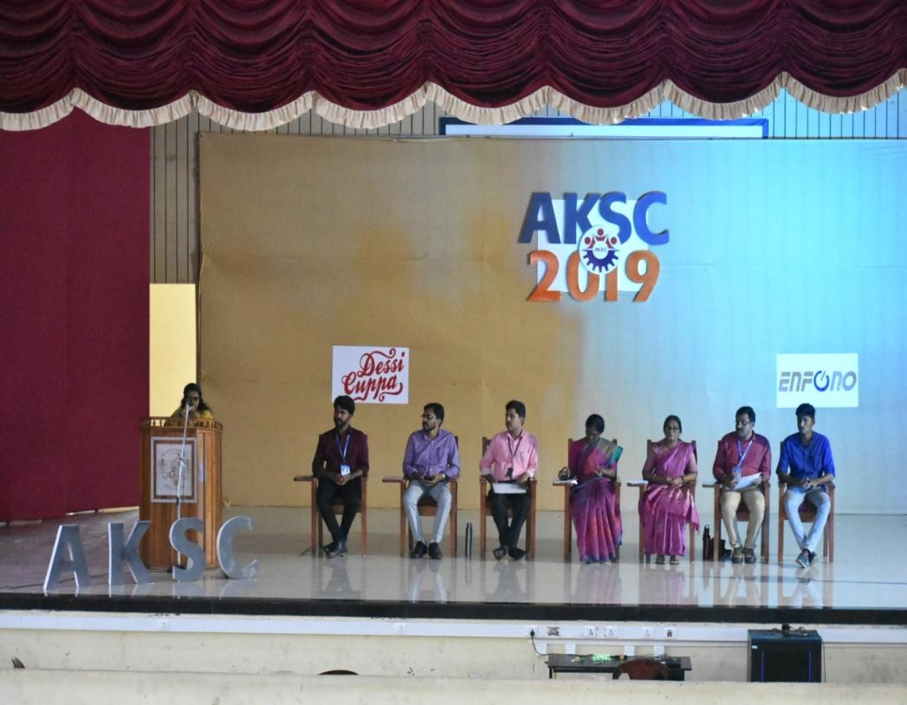
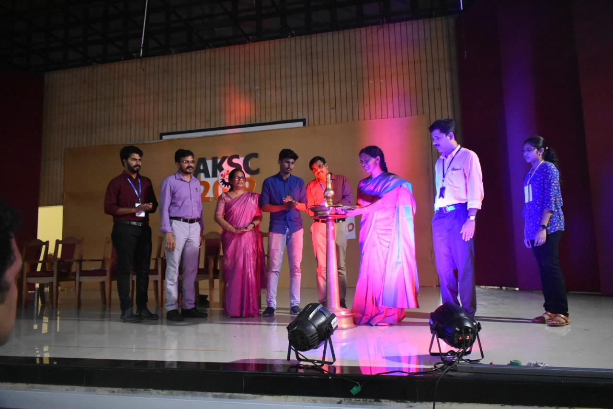
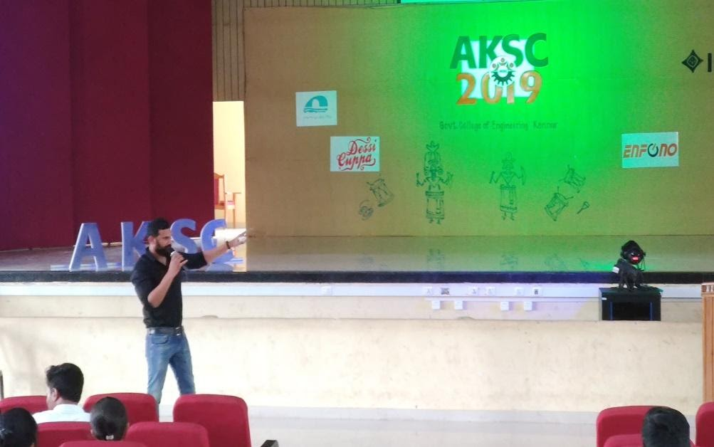

The IEEE All Kerala Student Congress 2019 (AKSC'19) was held at Government College of Engineering Kannur, on 25th, 26th and 27th of October 2019. Congress sees annual participation of almost 120 students from across the length and breadth of the state. It is a techno-managerial event which gave opportunities for student delegates to network among their peers and gets exposed to the various opportunities within IEEE.
  

#### Day 1
 
The event commenced at 10 am on the 25th of October with the inaugural ceremony. It got started by delivering the IEEE Code of Ethics by Abhinav S Praveen, Chairman of our IEEE SB GCEK. Our constant support for the event, Dr ManojKumar MV,  Branch counsellor of IEEE SB GCEK welcomed the gathering. Presidential Adress was delivered by Dr.M P Gilesh, Vice-Chair, Malabar Subsection by highlighting the importance of the event and also about the details of the events in the upcoming year.

The AKSC'19 was inaugurated with the lighting of the lamp by all the dignitaries present on the dais who graced the occasion with their valuable presence. It was then followed by an inaugural speech by the honourable principal of our esteemed college, Dr V O Rejini.

The inaugural ceremony came to an end with the felicitations delivered by Mr Nandan S (Student Activities Committee Chair, IEEE Kerala Section), Prof. Sreekumar (PG Dean) and Sreehari (College Union Chairman). It’s a customary note to thank the delegates and all those who have assembled. This duty was honoured by Mr Nazeeb Abdulla  (Student Representative, IEEE Kerala Section) with his vote of thanks.

The inaugural ceremony was followed by a motivational session by Praveen Arimbrathodiyil who shared his experience of how he became a pirate and the struggles that he had to face throughout his life.

The next session was handled by Sayanth N S, the founder of Enfono Technologies. His talk was about entrepreneurship development and was really helpful in aiding the young minds to conquer their dreams and goals in life.

A startling ice-breaking session was waiting for the participants paving the way to new fellowships. It involved a lot of games and activities to warm up the conversation among participants and fellowship. 
  
#### Day 2
 
The second day was set about with an informative session handled by Aishwarya PG. She discussed menstruation-related myths prevalent in India, their impact on women's lives, and about various strategies for the disposal of sanitary napkins in an environmentally friendly manner.

It was then followed by a YP track session handled by the Young Professionals of IEEE, Jithin and Shaun. Through that interactive session, the students were able to clear their doubts regarding IEEE  and its future scopes.
The afternoon session was handled by Akash Nambiar, a dynamic and resonating professional who shared his years of experience being part of IEEE as a volunteer.

A motivational talk by NSG Commando P V Maneesh created a sense of inspiration among the delegates by describing the brave operation his team had taken against the terrorist attack of Mumbai.

The next session by Adam Harry, the first transgender pilot, who shared his complete heart touching story of hardships and struggles that he had to face for being born as a transgender. He stresses that through school curriculum, students from a young age should be taught about the transgender community. "It's hard to live like an orphan when our parents are alive, he concludes. It was then followed by a photo session.

#### Day 3
 
The final day of All Kerala Student Congress 2019 commenced with an informative talk by Dr Anjana. She gave awareness about the possible causes of infection and the necessary precautions required to tackle them.

The next session was handled by Nanma Gireesh, a translational engineer who refreshed the minds of the participants with an interactive brainstorming session and built the skills of critical thinking among them. 

AKSC'19  winded up with a feedback session from the audience where the volunteers were highly appreciated for their hard work, coordination and for giving them the opportunity to have interactive sessions with young professionals. They thanked everyone for experiencing a mindblowing event.
