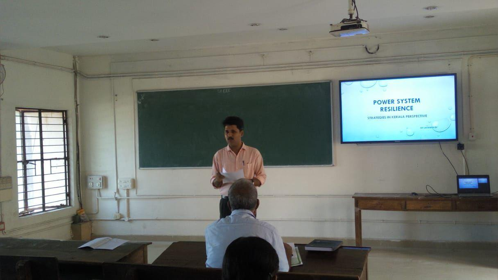

A Seminar Series competition conducted jointly by the KSEB Engineer's Association and the IEEE Power and Energy Society, Kerala Chapter was conducted in our college under the supervision of IEEE SB GCEK . The topic given by them for the seminar was POWER SYSTEM RESILIENCE. The judging panel included 4 members, among which 3 of them were from KSEB and one was our SB counsellor Dr.Manoj Kumar MV. Three students from our college took part in this and did their best during the seminar. Lavanya of S4 CSE and Varun of S2 ECA got selected for the district level.

