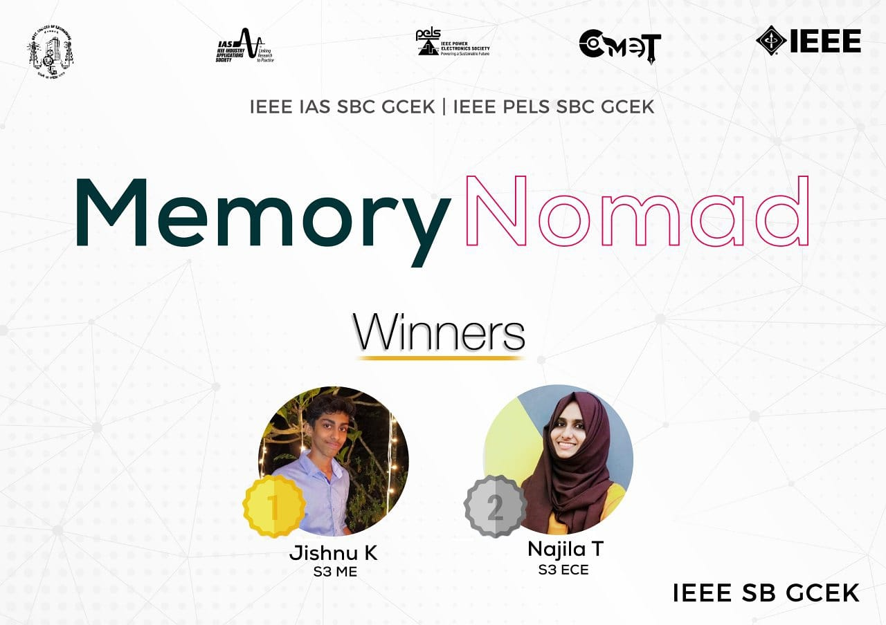

As part of second phase of COMET PELS and IAS Society of IEEE SB GCEK conducted a quiz completion ”Memory Nomad” on 28th September 2020 . The platform used was “testmoz” and the quiz was active from 7.30 to 7.50 and it was exclusively for the IAS and PELS members.The Question Set had three parts of which two of them were based on the webinars conducted as part of phase one of comet which are Electric Vehicles and LIFI, the third part was based on general technology. A total of 22 society members participated and Jishnu K of S3 ME and Najila T of S3 ECE bagged the first and second position respectively.

