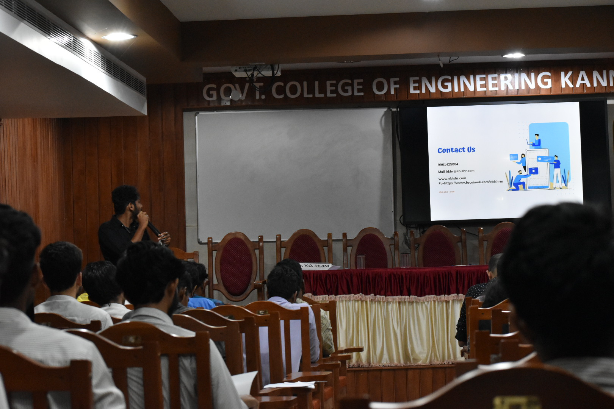

IEEE SB GCEK conducted an interactive hiring session on startup connect named Industry Institute Interaction for different start up ideas in students as a part of AVEGA ’20 Robofest.
The session began at 11.30 am and ended at 5.00 pm on 28th February 2020. The Interactive Session was held at Placement hall and the candidates were shortlisted for the next round, which was the interview. The interview and hiring session was held at conference hall.
Many of the interviewed students were hired as interns by these start-ups and various start-ups namely Shishiram, Digifobs, Ebis, Wapads, Evolve, Frofit, Erasb, were present at the venue and they offered future help for the selected start-up ideas after the hiring session.
All the participants were so active and energetic throughout the session. Refreshments were provided for the start-ups.

