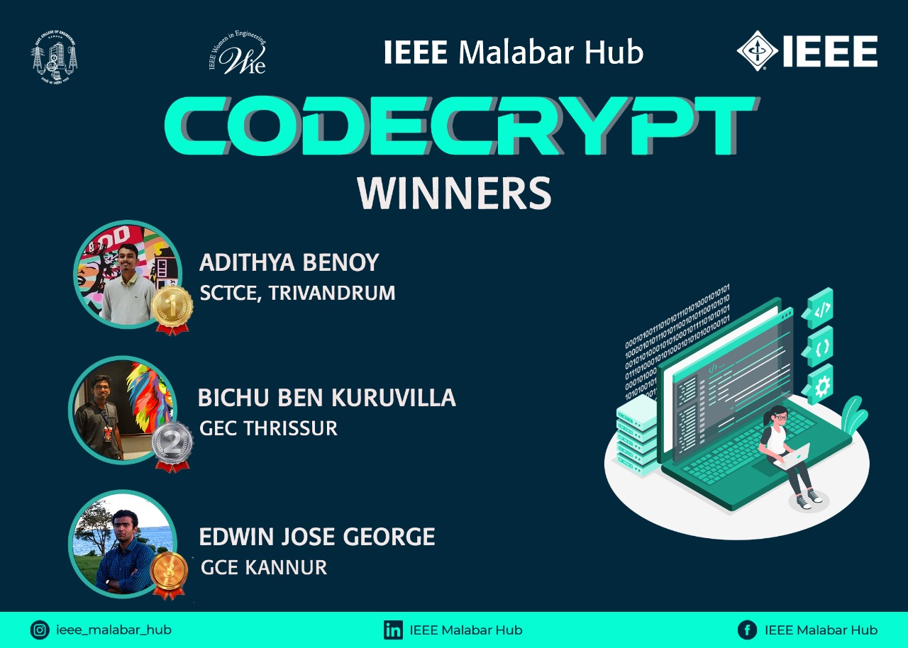

WiE IEEE Malabar Hub in collaboration with WiE AG IEEE SB GCEK organized a coding competition ‘CodeCrypt’ on 28th and 29th of April 2021. The event consisted of two rounds; the first round being a coding quiz via Quizizz on 28th followed by a Coding challenge in HackeRank on 29th. The event was successfully completed aligning with the objectives and aims perfectly. It also welcomed positive feedback from the participants and other members in terms of its organization and relevance. Students were able to brush up and enhance their coding and problem solving skills. 

