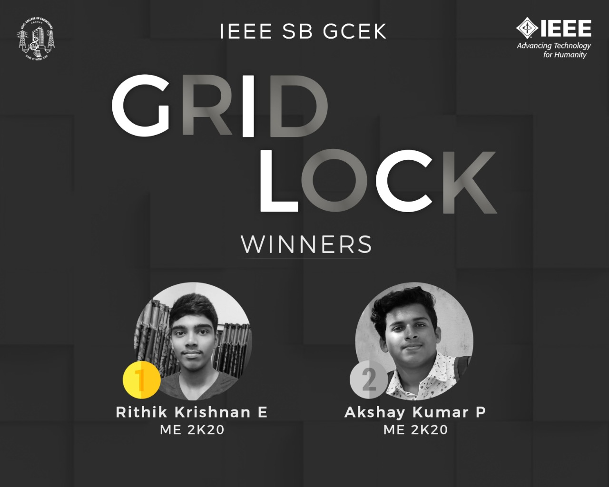

IEEE SB GCEK conducted Grid Lock, a picture puzzle through our Instagram and Facebook handles. There were four hidden grids which contained a clue about a famous personality. One grid unlocked each day based on the number of comments by participants. The clues were revealed at 8 PM every day. Participants could personally message their guess, in at most two chances. 
The answer was revealed on 1st May. The hidden personality was Katie Bouman, an American engineer and computer scientist working in the field of computer imagery. 
The event was open to all GCEKians. 127 students participated, comprising 103 IEEE members and 24 non-IEEE students.
The first prize was secured by Rithik Krishnan E of ME 2K20 batch, while the second prize was won by Akshay Kumar P of ME 2K20 batch. 

