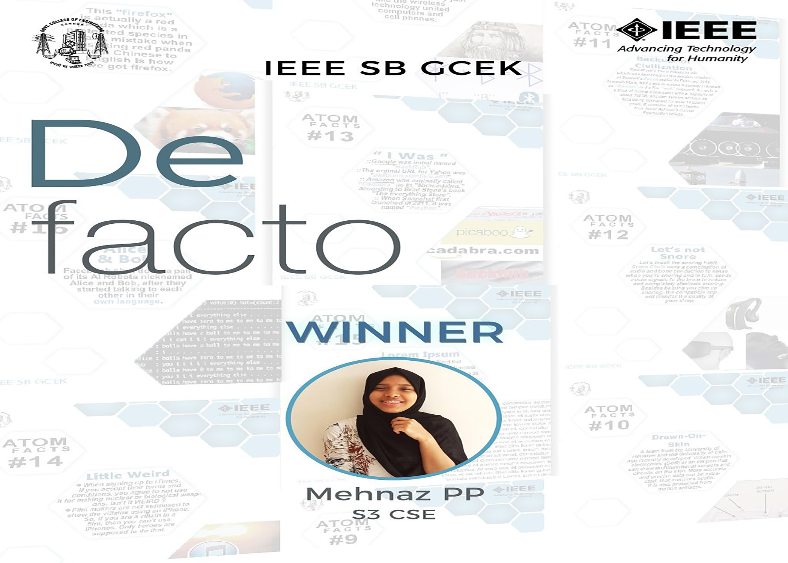

IEEE SB GCEK conducted an 'atom facts' designing competition, in which the participants are asked to find some interesting and amazing facts about differnet pieces of technology. Participants were given time till 30th October to submit their entries. This event was focused on the research and design skills of the IEEE Members of our SB. Judges had a tough time as it was difficult to choose the best. Mehanaz PP of S3 CSE bagged first prize and her entry was released as 'atom fact of the day' by SB.

