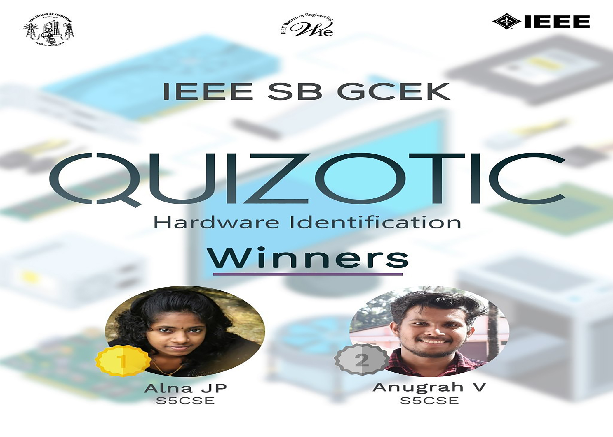

A hardware identification quiz was conducted under WIE Affinity Group of IEEE SB GCEK. The competition was conducted individually through the platform google forms. There were a total of 24 participants. For each question, an image of the hardware component was given. The Participants were asked to identify the image and choose the correct option from the choices. The total time allotted was 10 min and the total number of questions was 13. The questions were diverse and tricky.
Alna and Anugrah of S5 CSE were the ones who secured first and second positions respectively. All the participants were really thrilled to guess the hardware components that were given to them. Overall the event was a great success.
COORDINATORS: SUKRITHA KK, VISMAYA K, KEERTHANA
NO. OF PARTICIPANTS: 24

